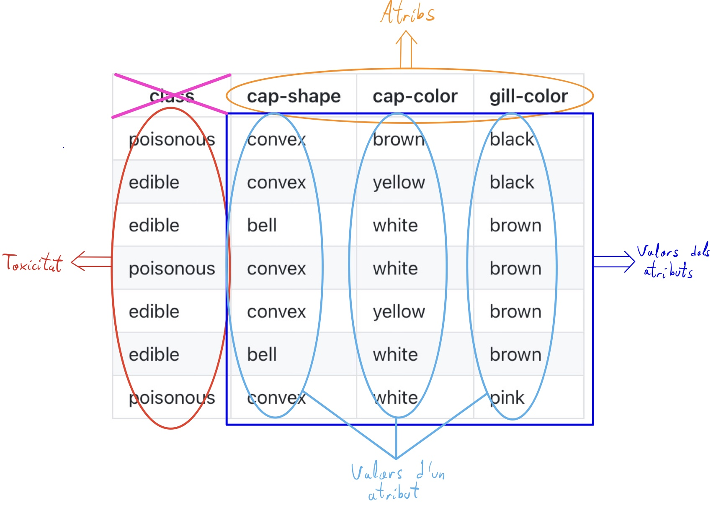

# Decision Trees

Generació d'arbres de decisió per a la classificació de bolets.

## Introducció

Per a aquesta pràctica hem implementat un algorisme que permet generar un arbre de decisió a partir d'un conjunt de dades entrants, corresponents a un llistat d'instàncies de bolets, amb les seves característiques corresponents. A partir d'aquest arbre podem fer una cerca i determinar de manera ràpida si un bolet és verinós o comestible, en funcio de les propietats que té.

## Execució

Per poder executar aquesta pràctica caldrà seguir les següents instruccions.

### Prerequisits

Per tal de poder executar els fitxers presentats caldrà tenir instal·lat el compilador de ghc per poder compilar haskell. En cas de no tenir-lo instal·lat, pots executar les següents comandes per a la descàrrega en ubuntu o seguir [aquestes instruccions](https://www.haskell.org/downloads/linux/).

```
sudo add-apt-repository -y ppa:hvr/ghc
sudo apt-get update
sudo apt-get install -y cabal-install-XXX ghc-YYY
```

### Compliació i execució

Per poder compilar el programa realitzat a la pràctica cal executar la següent comanda:

```
ghc dts.hs
```

Un cop compilat, es podrà executar mitjançant la comanda:

```
./dts
```

Un cop executat, caldrà seguir les instruccions que vagin apareixent per pantalla.

### Testing

Per a la realització dels tests hem utilitzat el llistat de dades agaricus-lepiota.data que es proporciona a l'enunciat. Aquest fitxer conté un llistat de dades on cada fila representa una instància de bolet, i cada columna en representa una de les seves 22 característiques. Per a cada instància, la primera columna indica si el bolet es comestible o verinós.

Originalment, el fitxer del que disposem conté cada instància en una fila, separada per un salt de línea, i cada atribut en una columna, separat per una coma. A més, El fitxer de dades original no disposa dels noms dels atributs a la primera fila, tal com es mostraven en l'exemple original de l'enunciat, en el qual m'he basat per resoldre la pràctica.

|   class   | cap-shape | cap-color | gill-color |   
|:---------:|:---------:|:---------:|:----------:|
| poisonous | convex    | brown     | black      |   
| edible    | convex    | yellow    | black      |   
| edible    | bell      | white     | brown      |   
| poisonous | convex    | white     | brown      |   
| edible    | convex    | yellow    | brown      |   
| edible    | bell      | white     | brown      |   
| poisonous | convex    | white     | pink       |   

Per aquesta raó, m'he pres la llibertat de modificar el fitxer d'entrada per tal de tenir a disposició els noms dels atributs a la primera fila. A més, he modificat també la divisió entre les columnes, utilitzant espais en comptes de comes. Això és degut a que la funció que he utilitzat per llegir les frases i separar-ne cada atribut depèn de l'espai per separar les paraules. 

Per tal d'entendre les dades del fitxer d'entrada, també se'ns proporcionava amb una guia per tenir clar quin valor d'un atribut representa cada lletra. Per tal de que el cost de l'algorisme no sigui molt elevat, he decidit deixar els valors dels atributs com a lletres, ja que és més curt i el seu temps de comparació és molt més reduit que el de la paraula que representa. Com que això pot ser confús per l'usuari, he guardat un arxiu adicional que conté la informació del que representa cada lletra per a cada atribut per tal de que un usuari no expert tingui una idea del que ha d'introduir. Per tal d'obenir aquesta informació, l'usuari introduirà "?" quan no sàpiga el valor d'un atribut. 

## Codi

Per tal d'explicar el codi el dividirem en les principals funcionalitats que el componen. Tindrem les funcions que s'encarreguen de llegir les dades i transformar-les a estructures que podem tractar, funcions per generar l'arbre de decisió i funcions per intaractuar amb l'usuari. A més tindrem les funcions auxiliars que permeten fer les tasques de transformació i tractat de dades.


### Dades

L'estructura de dades més important que tenim és el tipus Rule que emmagatzema l'arbre de decisió. Aquest tipus està definit per un node o un valor directe. Per als valors directes he decidit guardar si el bolet és verinós o comestible, però a més he reservat un espai per si es genera algún valor no comprès o incoherent al conjunt de dades. Per tant, en cas d'incoherencia o error en l'entrada donaria com a resultat NotClear, per indicar a l'usuari que no és segur ingerir el bolet sense consultar amb una font més fiable.
    
    data Rules = Atrib String [(String,Rules)] | Poisonous | Edible | NotClear

La resta d'estructura de dades utilitzades són prescindibles per a la correcta execució del programa. Tot i així, ens facilita l'organització i tractat de l'informació. 

    type Table = ([String], Info)

El tipus Table guarda tota la informació de la taula, inclosos els noms dels atributs, continguts en el primer paràmetre de la tupla.

    type Info = ([String],[[String]])
    
El tipus Info conté la informació de les files per cada instància de bolet. El primer paràmetre es correspòn a la primera columna, indicant la toxicitat del bolet (si és verinós o comestible). Els valors del primer paràmetre estàn ordenats per files en l'ordre inicial, i anirant variant en funció de com tractem les dades. 
En quant al segon paràmetre ens permet guardar el valor de cada atribut, on cada llista de strings representa una columna (és a dir els valors per a un atribut).

Per visualitzar millor aquesta estructura, aquí tenin un esquema:




### Main

La funció *main* és essencial en aquest codi per tal de poder tenir una execució interactiva, ja que ens permet establir un canal de entrada/sortida mitjançant el tipus IO(), el qual importem de System. 

    main :: IO()

A la funció *main* ens encarreguem de llegir el fitxer i dividir-lo per líneas, les quals convertim en dades que podem utilitzar. La funció infoLoader ens permetrà transformar el llistat de dades inicial als tipus de dades descrits anteriorment. Un cop tenim aquestes dades en un format amb el que podem treballar llavors podem generar l'arbre de decisió. Aquest procés és costos, pel que primer advertim a l'usuari de que pot trigar un temps en computar si el volum de dades és molt elevat.
Un cop generat l'arbre, l'ensenyem per pantalla per poder veure que l'arbre s'ha generat correctament. A més, en guardem una còpia al fitxer *decisionTree.txt*. Si ens fos d'interès podriem utilitzar aquest fitxer per carregar l'arbre de decisió i estalviar-nos el cost de càlcul. Tot i així, com aquest no és l'objectiu de la pràctica simplement guardem les dades que hem calculat. 
Un cop tenim l'arbre de decisió ja podem començar l'interacció amb l'usuari. La funció *poisonTest* retorna IO(), pel que serà en aquesta funció recursiva on interactuarem amb l'usuari fins obtenir una solució. L'unica informació que requereix aquesta funció és l'arbre de decisió.

### Carregar dades

Començarem explicant les funcions de lectura de dades, per tal de seguir el recorregut en ordre d'execució. La primera funció que trobem és *infoLoader*.

    infoLoader :: [String] -> Table
    
Aquesta funcó rep una llista de strings, on cada posició conté una línea de la taula que conté les dades. En aquesta funció agafem només la primera casella, corresponent a la primera fila que conté els noms dels atributs. Utilitzem la funcio de sistema *words* per separar la fila en paraules, i n'eliminem la primera ja que no ens interessa l'atribut *class*, referent a la toxicitat. Guardem els atributs al primer paràmetre del tipus Table que retornarem en aquesta funció. Per al segon paràmetre cridem a la següent funció.

Originalment disposava de dues funcions que em permetien descomposar la resta de la informació. Donat que la matriu generada inicialment conté una llista per files, utilitzava la funció *toxicityLoader* per seleccionar només el primer valor de cada fila, és a dir la primera columna, corresponent als valors de toxicitat. Després amb la funció *decoder* recorria la resta de la matriu també separant per columnes els atributs. Aquest era un procés costós i laboriós, pel que l'he acabat simplificant amb la funció auxiliar *flipMat*.

#### Funcions auxiliars d'inicialització
La funció *flipMat* transforma una matriu m[i][j] en una matriu m[j][i]. D'aquesta manera la feina de separar les columnes es simplifica drasticament, permetent realitzar-la només amb un cost θ(n*m).

    flipMat :: [[String]] -> [[String]]

Per poder utilitzar aquesta funció, es requereix primer de la funció *recWords*, que l'unic que fa és aplicar la funció *words* explicada anteriorment de manera recursiva. Això ens permet obtenir una matriu de la llista de files que teníem anteriorment.

    recWords :: [String] -> [[String]]

Tot i que ja no són necessàries aquestes funcions, he preferit deixar-les comentades per tal de reflectir el progrés que hi ha hagut en el desenvolupament dels algorismes per la pràctica.

### Conversió de dades

El procés de generació d'arbres de decisió és la part més complexa i costosa de tot el sistema. La funció principal d'aquesta part és *construeixArbre*, tot i que depèn de la funció *construeixFillsArbre* per poder fer la recursivitat.

    construeixArbre :: Table -> Rules

La funció *construeixArbre* genera un node de tipus Rule (l'estructura en forma d'arbre que hem definit). Per fer-ho, primer agafa l'atribut amb més probabilitats d'una solució directa. Aquest càlcul està explicat a les transparències sobre machine learning proporcionades per a la pràctica, i es calcula a la funció auxiliar *mostProbable*. 
En cas d'empat entre els atributs més probables, es selecciona el primer en l'ordre inicial (començant per l'esquerra). En els exemples proporcionats a l'enunciat de la pràctiaca i de la documentació, en cas d'empat s'agafa un altre atribut sense cap criteri explícit, pel que a la meva implementació he decidit agafar el primer, per tal de seguir algún ordre coherent.

Un cop tenim l'atribut amb més probabilitat, el posem al principi de la llista per avaluar-lo seguidament. Per fer l'avaluacio de l'atribut i els seus descendents (en cas d'haver-hi), la funció *construeixArbre* crida la funcio *construeixFillsArbre*.

    construeixFillsArbre :: Table -> [(String,Rules)]

La funció *construeixFillsArbre* rep una taula on el primer atribut ja serà el més adient per la avaluació. Per a aquest atribut, agafarà el primer valor disponible i comprovarà si és directe, és a dir, si per a tots els casos on hi ha aquest valor hi ha només una solució (o verinós o comestible). De ser així, afegirà a la llista de fills el string corresponent al nom del valor i el seu resultat. A més, eliminarà tots els casos amb el mateix valor, per tal de seguir comprovant la resta de valors possibles de l'atribut. Això ho fa amb la funció *divideixFiles*, explicada posteriorment.

En cas de no ser un valor directe, es seleccionaràn totes les files corresponents a aquell valor i s'evaluaran cirdant a la funció *construeixArbre*, construint un subarbre per al valor concret.

En qualsevol dels dos casos, mentres la llista de casos no quedi buida es seguiran avaluant els casos restants per determinar, per a cada atribut, totes les branques corresponents als seus valors.

Cal destacar que la complexitat per fer aquest tipus de recursivitat en haskell es bastant alta, ja que en la majoria de llenguatjes imperatius disposen de la possibilitat de fer funcions iteratives i permeten simplificar la recursivitat. Per contra, a haskell hem d'utilitzar aquesta "*doble recursivitat*" per poder aconseguir el mateix resultat.

#### Funcions auxiliars de conversio de dades

Aquestes funcions són la base dels càlculs de la part de conversió de dades. La primera que analitzarem serà *mostProbable*.

    mostProbable :: Info -> Int -> Int -> Float -> Int

Aquesta funció rep com a primer paràmetre el llistat de dades útils (la toxicitat i els valors dels atributs) i determina la posició de l'atribut més optim. Per fer-ho consta de tres paràmetres adicionals. El primer és la posició de l'atribut que s'està avaluant, el segon la posició del l'atribut amb el millor valor trobat fins al moment (ens servirà per retornar-lo, és com una mena de pas per referència) i finalment el millor valor aconseguit (limitat per 1, el millor valor possible). Si en algun moment el valor d'un atribut és 1, es retorna directament la seva posició, ja que no hi ha manera d'obtenir un resultat millor, i en cas de resultat igual seria igualment el primer atribut trobat el que volem. En cas de tenir valors més petits que 1 s'anià avaluant fins que s'acabin els atributs. Per avaluar la optimalitat d'un atribut utilitzem la funció *getProb*.

    getProb :: [String] -> [String] -> Int

La funció *getProb* rep com a primer paràmetre el llistat de valors de toxicitat i com a segon paràmetre el llistat de valors de l'atribut que se li passa. A partir d'aqui calcula una puntuació, que serà la que després es dividirà pel nombre de valors total per obtenir un rang (0,1]. Per calcular s'agafa el primer valor de l'atribut i s'envia a la funció *countAtribs*, que calcula per a aquell valor en quantes instàncies és verinós i en quantes comestible, retornant el valor més elevat. Aquest valor després se suma amb els valors que proporcionen la resta d'atributs al fer la crida recursiva eliminant les files que contenen el valor avaluat.

    countAtribs :: String -> [String] -> [String] -> Int

La funció *countAtribs* és la funció intermitja per executar la funció d'immersió countAtribsI inicialitzada a 0.

    countAtribsI :: String -> [String] -> [String] -> Int -> Int -> Int

La funció *countAtribsI* fa el que hem descrit anteriorment, rep el valor de l'atribut a comparar i les llistes que contenen la toxicitat i els valors de l'atribut. També rep dos enters inicialitzats a 0 que serveixen de contadors per quan el valor correspon a un bolet verinós o comestible respectivament. Quan la llista és buida retorna el valor més gran.

    removeAtribX :: String -> [String] -> [String] -> [String]
    removeAtribY :: String -> [String] -> [String] -> [String]

Les funcions *removeAtribX* i *removeAtribY* venen a ser el mateix, eliminen els atributs de la fila que siguin iguals a l'atribut donat al primer paràmetre, que normalment serà aquell que s'esta avaluant a la funcio *countAtribsI*. El fet de que hi hagi dues funcions quasi idèntiques és perquè una modifica la llista de toxicitat i l'altra la llista de valors. Aquesta funció es podria simplificar retornant un un parell ([String],[String]), tal com he acabat fent posteriorment en funcions com *divideixFiles*, i així sería més eficient, però he considerat deixar-ho així per simplicitat.

    toxicityDirect :: String -> String -> [String] -> [String] -> Bool

Aquesta funció detecta si tots els valors d'un atribut igual al del primer paràmetre tenen la mateixa toxicitat. El segon paràmetre correspòn al primer valor de toxicitat, que serveix per comparar si tots son iguals a aquest. Les dues llistes tornen a ser en aquest cas la llista de toxicitats i la de l'atribut en qüestió.

    divideixFiles :: String -> Info -> (Info,Info)

La funció *divideixFiles* separa les files o instàncies corresponents al valor del primer paràmetre de l'atribut que estem avaluant (el primer de la llista). Per tal de poder retornar un parell on els dos valors del parell contenen llistes no podem començar la recursivitat des del primer element, ja que no podem sumar una posició al final. Per aquesta raó explorem primer la recursivitat fins al final i guardant els valors a la variable res, la qual despres podem accedir per afegir l'element del principi fàcilment.

    afegeirPrimer :: [[String]] -> [[String]] -> [[String]]

La funció *afegirPrimer* ens serveix per afegir recursivament la fila d'atributs que estem avaluant al llistat final. El primer paràmetre conté una llista amb la llista d'elements de la primera fila, mentres que el segon conté totes les files inferiors que ja han sigut seleccionades, tant si es per tenir el valor a avaluar o per no tenir-lo.

    getPrimer :: [[String]] -> [[String]]

La funció *getPrimer* retorna la primera fila per a cada atribut de la llista de valors proporcionada al primer paràmetre.

    eliminaPrimer :: [[String]] -> [[String]]

La funció *eliminaPrimer* té l'efecte invers, elimina el primer element de cada atribut a la llista de valors.

    putFirst :: Int -> [a] -> [a] -> [a]

Finalment la funció *putFirst* s'encarrega de posar al devant l'element més òptim que hem trobat amb la funció *mostProbable*. Com hem vist abans, la funció *mostProbable* retorna una posició. Això ens serveix per localitzar l'atribut en aquella posició i posar-lo devant. Per tant, el primer paràmetre és la posició a seleccionar, que ens serveix alhora de contador per anar contant les iteracions. El segon paràmetre és la llista inicial i el tercer és la llista auxiliar que ens permet anar guardant els atributs que anem trobant que no són el que volem.
Cal destacar que el tipus d'aquesta funció no està definit. D'aquesta manera el podem utilitzar tan per moure la llista de noms dels atributs que és de tipus [String] com la llista dels valors dels atributs que és de tipus [[String]].

### Interacció

Per acabar, trobem dues funcions que ens permeten interactuar amb l'usuari. Per fer-ho, aquestes funcions no retornen valor, sinó que retornen el tipus IO(), que ens permet escriure i llegir per pantalla. La primera funció que trobem es *poisonTest*.

    poisonTest :: Rules -> IO()

Aquesta és la funció principal de la part d'interacció. A partir de l'arbre de decisió que li passem s'encarrega de demanar les dades necessàries de cada atribut per poder donar una resposta a l'usuari. Per tal de que l'usuari tingui clar el que ha d'introduir, es facilita el nom de l'atribut que s'esta avaluant (el nom del node) i el llistat de valors possibles que té, que obtindrem amb la funció *getAtribs*. A les dades que ens proporcionen, els valors dels atributs estàn codificats amb només una lletra. Això pot suposar un problema per a la comprensió del domini per part de l'usuari, si aquest no és expert. Per això es proporciona l'opció d'obtenir el llistat de noms corresponents a cada inicial, per a cada atribut. Per activar aquesta opció, s'indica a l'usuari d'introduir el caràcter "?" en cas de dubte, i aquest proporciona la informació necessària. Aquesta informació està emmagatzemada al fitxer guide.txt, pel que és important no eliminar-lo del directori on es troba inicialment.
Tot i no ser la manera més eficient de treballar, ja que podríem per exemple substituir cada lletra pel nom corresponent al seu valor, he considerat que no val la pena la complexitat que això afegeix. A més l'ús d'inicials redueix els errors en usuaris inexperts i augmenta la rapidesa per als usuaris experts. En cas d'introduir un valor diferent a "?", es crida la funció *findAtrib*.

    findAtrib :: String -> [(String,Rules)] -> IO()

Aquesta funció recorrerà els valors possibles, i si troba un igual al valor proporcionat al primer paràmetre avaluarà el subarbre corresponent a aquest. En cas de no trobar cap valor que s'ajusti a l'introduit, donarà un missatge d'error i terminarà el programa.

#### Funcions auxiliars d'interacció

Aquí trobem dues funcions.

    getAtribs :: [(String,Rules)] -> [String]

La funció *getAtribs* retorna el llistat de valors possibles per a l'atribut proporcionat. Rep com a paràmetre d'entrada el llistat de fills de l'atribut avaluat, on cada un té com a primer paràmetre de la tupla el nom del valor per a aquell subarbre.

    myConcat :: [String] -> String

Aquesta funció concatena els valors obtinguts amb la funció *getAtribs* per mostrar-los en un format de llista comprensible per l'usuari.

#### Funcions d'impresió

Les funcions d'impresió permeten transformar els tipus de dades empreats en un format string llegible i comprensible.

    testPrint :: String -> Rules -> String
    testPrintI :: String -> [(String,Rules)] -> String

La funció *testPrint*, juntament amb la seva funció d'immersió *testPrintI* permeten formar una doble recursivitat per guardar els arbres de decisió en forma de string i amb un format que he considerat comprensible. A diferència del format de la pràctica, que es basa en espais i tabuladors, jo he decidit utilitzar claudàtors per englobar els subarbres d'un atribut, i després els salts de línea, espais i tabuladors per indicar cada valor i el seu resultat.

    printTable :: Table -> IO()
    printList :: [String] -> String
    printLoop :: [[String]] -> String

Les funcions *printTable*, *printList* i *printLoop* permeten mostrar per pantalla les taules, mostrant primer els noms dels atributs, després els valors de toxicitat i finalment la taula de valors.
Aquesta funció només s'ha utilitzat amb funcionalitat de testing, per observar la correctesa d'algunes de les funcions implementades. Tot i així, en cas de voler-les utilitzar queden a dispocició de l'usuari.

## Autors

* **Andreu Pla** 

## Referències

* [Enunciat](https://gebakx.github.io/hs-dts/#refer%C3%A8ncies) Q1 2020-2021
* Gerard Escudero, 2020. [Machine Learning](https://gebakx.github.io/ml/#36).
* Jeff Schlimmer, 1981. [Mushroom Data Set](https://archive.ics.uci.edu/ml/datasets/Mushroom). [UCI Machine Learning Repository](https://archive.ics.uci.edu/ml/index.php).
